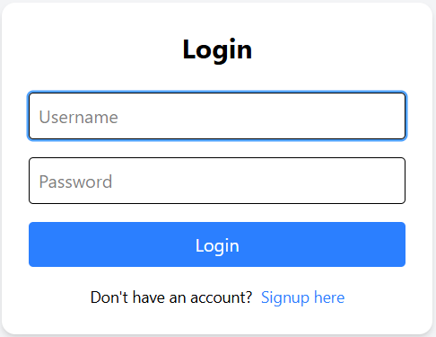
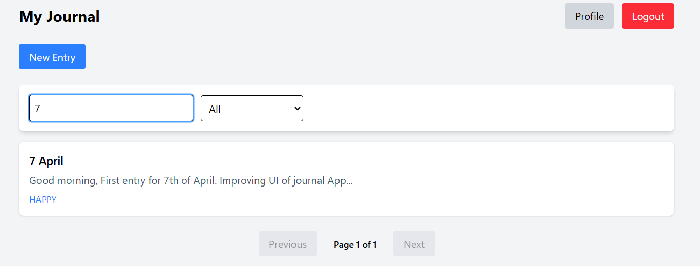
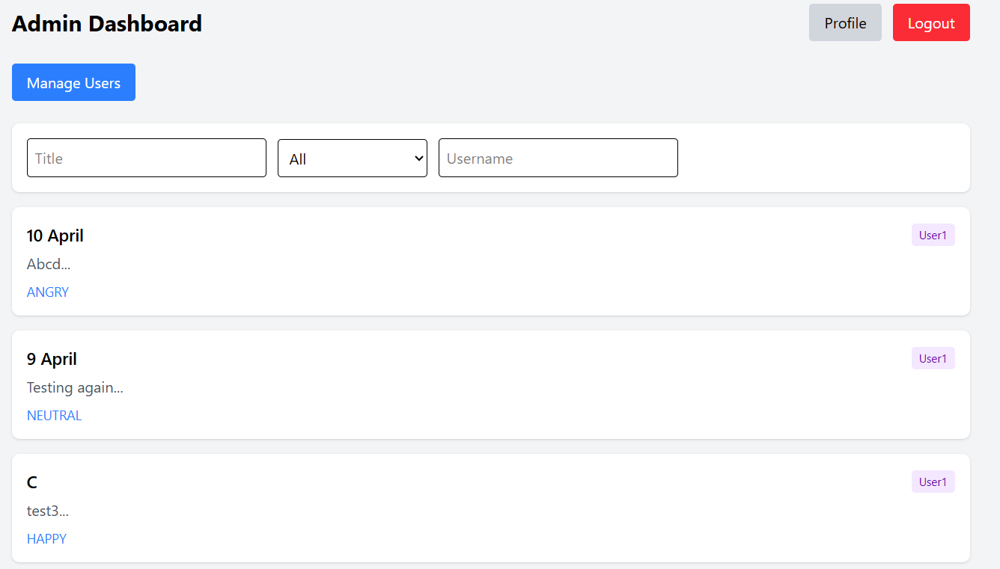
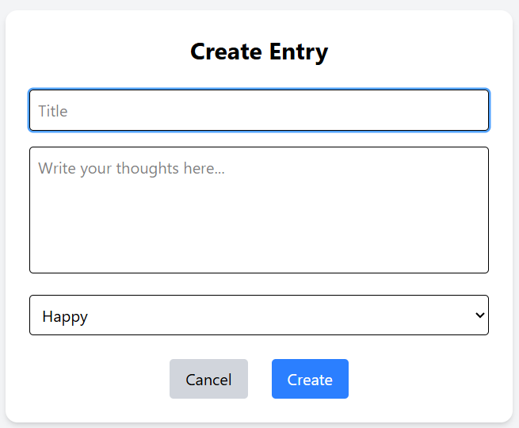
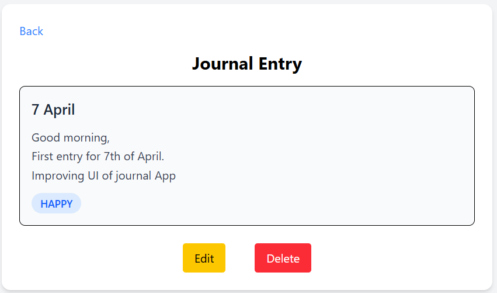
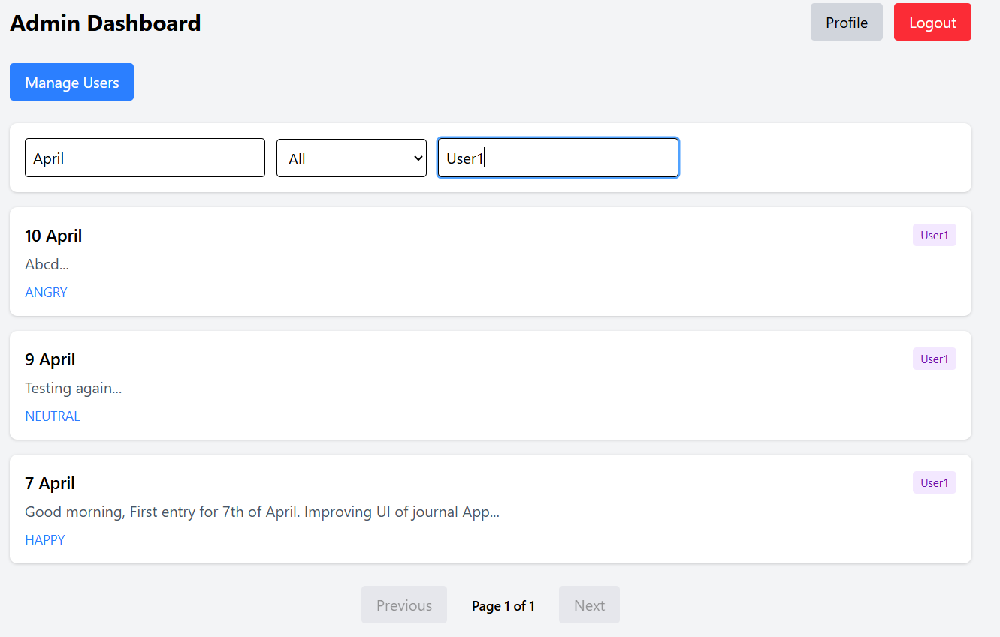

# Journal App (Full-Stack)

A secure and scalable **full-stack journal management application**  
with authentication, role-based access, and a clean admin dashboard.

Built using **Spring Boot (backend)** and **React (frontend)**, deployed on cloud platforms.

---

## Live Demo

- 🌐 Frontend: <https://journal-app-frontend-green.vercel.app>
- ⚙ Backend: <https://journal-backend-3mx6.onrender.com>

---

## Features

### Authentication & Security

- JWT-based authentication
- User Signup & Login
- Password encryption using BCrypt
- Protected routes (frontend + backend)

---

### User Features

- Create, update, delete journal entries
- View personal journal entries only
- Change password with validation

---

### Admin Features

- View all users' journal entries
- Filter entries by:
  - Title
  - Sentiment
  - Username
- Pagination support
- Entries sorted by latest (createdAt DESC)
- Username displayed in admin dashboard

---

### Frontend Features

- Clean responsive UI (React + Tailwind)
- Protected routes using auth guards
- Admin dashboard with filters & pagination
- API integration using Axios
- Environment-based configuration

---

### Backend Features

- RESTful API using Spring Boot
- DTO + Mapper architecture
- Global exception handling
- Request validation
- Logging with SLF4J
- Swagger API documentation

---

## Tech Stack

### Backend

- Java 17
- Spring Boot
- Spring Security
- JWT
- MongoDB
- Maven
- Lombok

### Frontend

- React (Vite)
- Axios
- Tailwind CSS

### DevOps / Deployment

- Render (Backend)
- Vercel (Frontend)
- Environment Variables
- Docker (basic setup)

---

## Authentication Flow

1. User logs in with credentials  
2. Backend validates user  
3. JWT token is generated  
4. Token stored in frontend (localStorage)  
5. Sent in every request:

```http
Authorization: Bearer <token>
```

6. A custom **JWT filter**:
    * Extracts token
    * Validates it
    * Sets authentication in **SecurityContext**
7. Protected endpoints are accessible only with a valid token.

---

## API Endpoints

### Auth APIs

| Method | Endpoint     | Description       |
| ------ | ------------ | ----------------- |
| POST   | /auth/signup | Register new user |
| POST   | /auth/login  | Login & get JWT   |

---

### User APIs (Protected)

| Method | Endpoint         | Description              |
| ------ | ---------------- | ------------------------ |
| GET    | /user/me         | Get current user details |
| POST   | /user/changePass | Change user password     |
| DELETE | /user/delete     | Deletes current user     |

---

### Journal APIs (Protected)

| Method | Endpoint             | Description          |
| ------ | -------------------- | -------------------- |
| POST   | /journal/create      | Create journal entry |
| GET    | /journal/getAll      | Get all user entries |
| GET    | /journal/get/{id}    | Get entry by ID      |
| PATCH  | /journal/update/{id} | Partial update entry |
| DELETE | /journal/delete/{id} | Delete entry         |

---

### Admin APIS (Protected)

| Method | Endpoint                 | Description            |
| ------ | ------------------------ | ---------------------- |
| GET    | /admin/entries           | Get all entries        |
| DELETE | /admin/delete/{userName} | Delete non-admin users |

---

## Key Concepts Implemented

- JWT Authentication (custom filter)
- Role-based access (Admin/User)
- DTO & Mapper pattern
- Pagination & filtering (MongoTemplate)
- Global exception handling
- Secure password change flow
- Frontend route protection

---

## Setup Instructions

1. Clone repo

```bash
git clone <https://github.com/LegiOnGH/journalAppV2.git>
cd journal-app
```

2. Backend Setup

```bash
cd backend
```

Create .env or configure:

```.env
MONGO_URI=your_mongo_uri
JWT_SECRET=your_secret
JWT_EXPIRATION=your_expiration_time
```

Run:

```
mvn spring-boot:run
```

3. Frontend Setup

```bash
cd frontend
```

Create .env:

```bash
VITE_API_URL=http://localhost:8080
```

Run:

```bash
npm run dev
```

---

## Exception Handling

Centralized using `@ControllerAdvice`

| Scenario              | Status Code |
| --------------------- | ----------- |
| Validation failure    | 400         |
| Bad request           | 400         |
| Unauthorized          | 401         |
| Forbidden             | 403         |
| Resource not found    | 404         |
| Internal server error | 500         |

---

## Project Structure

```text
frontend
├── src
│   ├── components
│   ├── pages
│   ├── services
│   ├── utils
│   ├── App.jsx
│   ├── index.css
│   └── main.jsx
└── index.html
    
backend
└── src/main/java
    └── com.example.legion.journalApp2
        ├── config
        ├── controller
        ├── dto
        │   ├── request
        │   └── response
        ├── entity
        ├── enums
        ├── exception
        ├── mapper
        ├── repository
        ├── security
        ├── service
        └── JournalApp2Application
```

---

## Screenshots

### Login Page



### User Dashboard



### Admin Dashbaord



### Create Entry



### View Entry



### Filters



---

## Future Improvements

- Refresh tokens
- Role-based UI enhancements
- Redis caching
- Kafka event streaming
- Notifications system

---

## Learning Outcomes

- Built full-stack app with authentication
- Implemented JWT security from scratch
- Understood Spring Security deeply
- Handled real-world issues (CORS, deployment)
- Designed admin dashboard with filtering
- Learned deployment with Render & Vercel

---

## Author

**Priyanshu Katwal**  
Full Stack Developer | Java | Spring Boot | React
